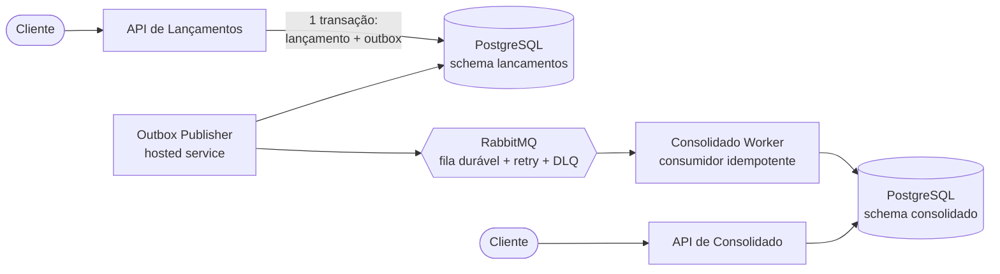

# Fluxo de Caixa

Controle de fluxo de caixa diário de um comerciante: registro de lançamentos (créditos e débitos) e consulta do saldo consolidado por dia.

## O requisito que guiou a arquitetura

O desafio traz um requisito não funcional que vale mais que todos os outros juntos: o serviço de lançamentos não pode ficar indisponível se o consolidado cair. Isso é um requisito de isolamento de falha, e ele elimina qualquer desenho em que a consolidação participe do caminho crítico da escrita.

A resposta são dois domínios de falha independentes, conectados apenas por eventos:



Nenhuma seta síncrona cruza de um lado para o outro. O lançamento é persistido junto com a intenção de publicação na mesma transação local (Transactional Outbox), a resposta ao cliente não espera o broker, e o consolidado é uma projeção alimentada por eventos com entrega at-least-once e consumo idempotente. Se o worker, a API de consolidado ou o próprio RabbitMQ caírem, lançamentos continuam sendo aceitos; o backlog fica retido (outbox ou fila durável) e converge quando o componente volta.

## Como executar

Pré-requisitos: Docker e Docker Compose.

```bash
docker compose up --build
```

| Serviço | Endereço |
|---------|----------|
| API de Lançamentos | http://localhost:8081 |
| API de Consolidado | http://localhost:8082 |
| Worker (health) | http://localhost:8083/health/ready |
| RabbitMQ management | http://localhost:15672 (fluxo/fluxo) |

Registrar um crédito:

```bash
curl -X POST http://localhost:8081/api/v1/lancamentos \
  -H "Content-Type: application/json" \
  -H "X-Merchant-Id: 11111111-1111-1111-1111-111111111111" \
  -H "Idempotency-Key: pedido-42" \
  -d '{"tipo": "CREDITO", "valor": 100.00, "descricao": "Venda balcão"}'
```

Consultar o consolidado do dia:

```bash
curl http://localhost:8082/api/v1/consolidado/$(date -u +%F) \
  -H "X-Merchant-Id: 11111111-1111-1111-1111-111111111111"
```

A resposta inclui `atualizadoEm` e `consistencia: eventual`. O consolidado pode estar alguns segundos atrás da escrita, e a API diz isso em vez de esconder.

O roteiro completo de demonstração (parar o worker, seguir registrando, religar, conferir convergência, reenviar chave repetida) está automatizado em `scripts/demo.sh` e roda no CI em pull requests e em pushes para a main.

## Como testar

```bash
dotnet test tests/FluxoDeCaixa.UnitTests            # domínio e caso de uso, sem I/O
dotnet test tests/FluxoDeCaixa.ArchitectureTests    # regras de dependência entre projetos
dotnet test tests/FluxoDeCaixa.IntegrationTests     # Postgres e RabbitMQ reais via Testcontainers
```

Os testes de integração cobrem o que importa: outbox gravada na mesma transação do lançamento, idempotência da API (mesma chave, um lançamento), evento duplicado sem efeito duplo no saldo, worker indisponível sem impacto na escrita com convergência posterior, e broker indisponível com a outbox retendo e drenando depois.

Carga: `k6 run tests/load/consolidado.js` (cenários de 50, 100 e 250 req/s via `-e CENARIO=`). O script define os thresholds; os números dependem da máquina onde rodar.

## Decisões principais

| Decisão | Motivo curto | Detalhe |
|---------|--------------|---------|
| Dois serviços, comunicação só por eventos | Isolamento de falha exigido pelo desafio | [ADR-001](docs/adr/ADR-001-service-boundaries.md), [ADR-002](docs/adr/ADR-002-async-communication.md) |
| Transactional Outbox | Elimina o dual-write entre banco e broker | [ADR-003](docs/adr/ADR-003-transactional-outbox.md) |
| Consistência eventual com frescor exposto | Consequência do isolamento; monitorável e comunicada | [ADR-004](docs/adr/ADR-004-eventual-consistency.md) |
| CQRS simples, sem Event Sourcing | Separação de modelos sem o custo de versionar eventos históricos | [ADR-005](docs/adr/ADR-005-cqrs-without-event-sourcing.md) |

O que ficou de fora de propósito: Redis (Postgres atende 50 req/s com folga de sobra; cache entra quando métrica mostrar necessidade), Kafka (sem requisito de replay ou retenção longa), Kubernetes, API Gateway, Event Sourcing, estorno, multi-moeda. Cada ausência tem gatilho de revisão em [trade-offs-and-evolution.md](docs/trade-offs-and-evolution.md).

## Documentação

| Documento | Conteúdo |
|-----------|----------|
| [architecture.md](docs/architecture.md) | Drivers, C4, fluxos, domínios de falha, consistência |
| [non-functional-requirements.md](docs/non-functional-requirements.md) | SLOs propostos, capacidade, resiliência, RPO/RTO |
| [operations-security.md](docs/operations-security.md) | Segurança, observabilidade, health checks, operação |
| [trade-offs-and-evolution.md](docs/trade-offs-and-evolution.md) | Cada decisão com custo e alternativa; evolução em 3 estágios |
| [docs/adr/](docs/adr/) | 5 registros de decisão |

## Escopo assumido

Autenticação real está fora do MVP: `X-Merchant-Id` vem de header e, em produção, seria derivado do token OIDC (nunca de entrada do cliente). Estorno, multi-moeda, múltiplas contas e extrato são evolução documentada, não implementada. A escrita da primeira versão prioriza o que lida com dinheiro: transação local, idempotência nas duas pontas, at-least-once assumido explicitamente e backlog observável.
