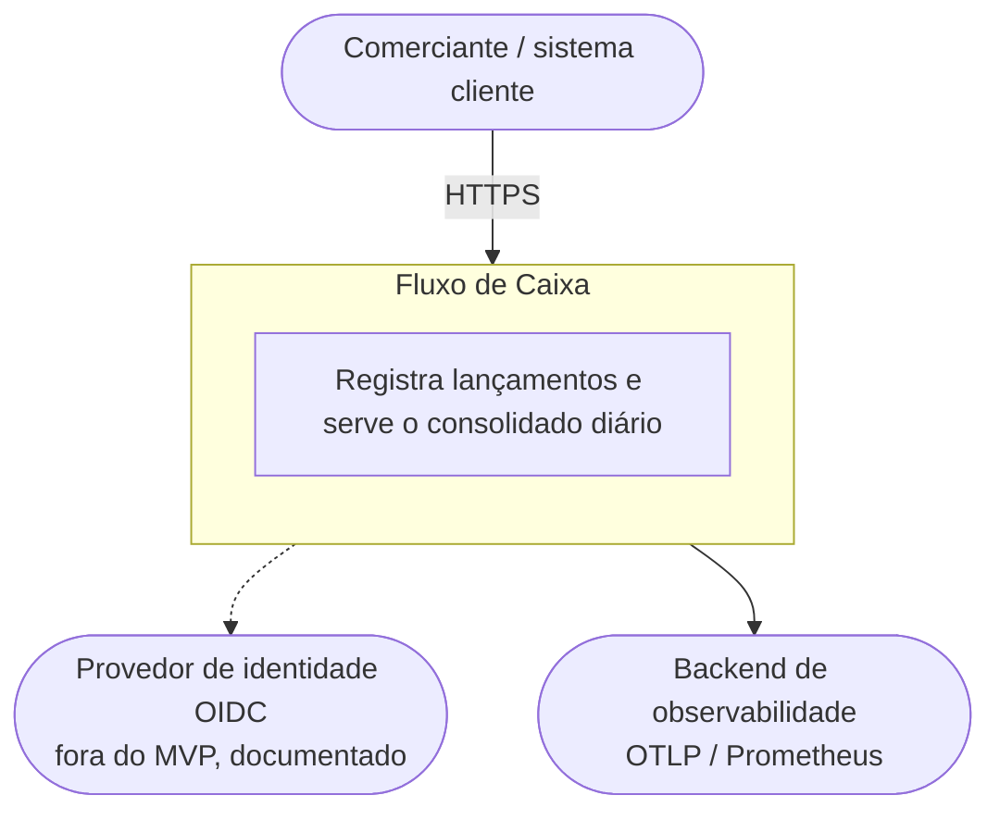
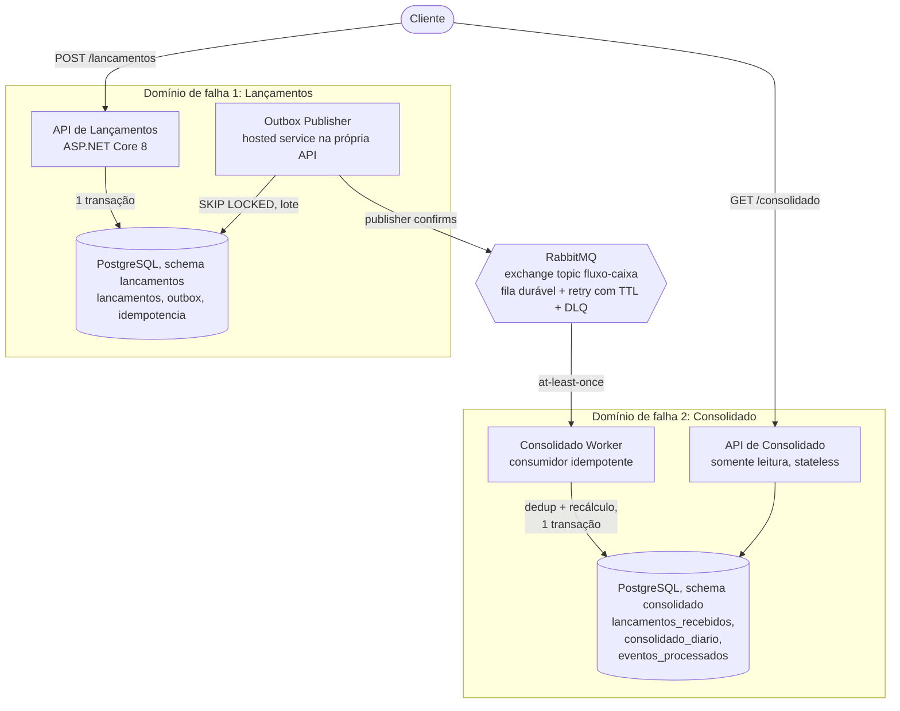
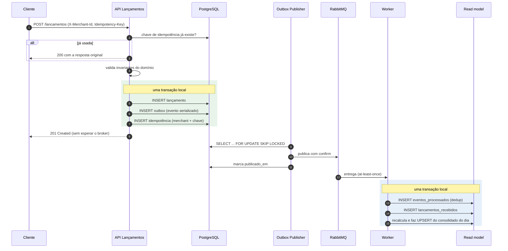
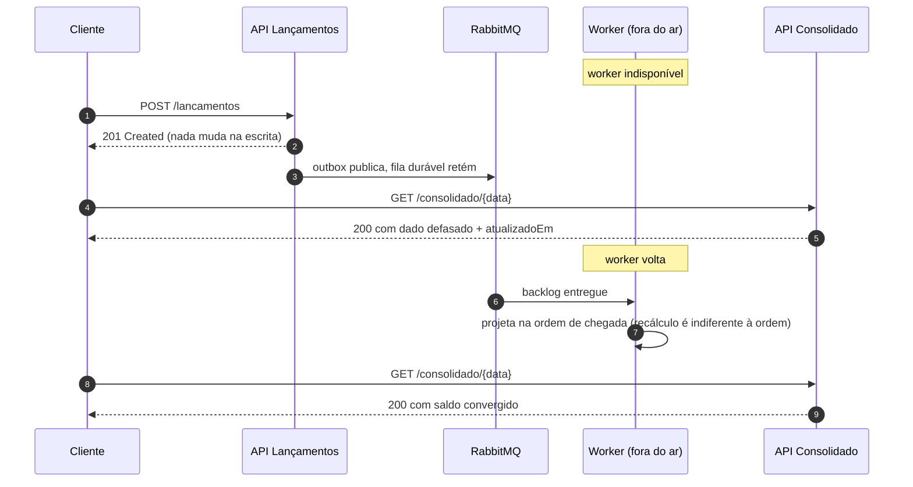

# Arquitetura

## Contexto e drivers

Um comerciante registra créditos e débitos ao longo do dia e consulta o saldo consolidado diário. Dois requisitos do desafio moldam o desenho; o restante é consequência.

O primeiro: o serviço de lançamentos não pode ficar indisponível se o consolidado cair. Lido com precisão, isso significa que os dois lados não podem compartilhar domínio de falha: nem processo, nem transação, nem chamada síncrona no caminho da escrita. O requisito favorece o isolamento entre os domínios de lançamento e consolidação, e a separação foi adotada para que falha, indisponibilidade ou degradação do consolidado não façam parte do caminho crítico de registro financeiro.

O segundo: o consolidado recebe até 50 req/s em pico, com no máximo 5% de perda. É uma carga modesta. Ela não justifica cache, nem broker de log distribuído, nem autoscaling agressivo. Justifica índice correto, serviço stateless e a possibilidade de escalar horizontalmente quando precisar.

Há um terceiro driver implícito em qualquer sistema que lida com dinheiro: lançamento aceito não pode ser perdido, nem duplicado. Esse driver não aparece no enunciado porque ninguém precisa escrevê-lo.

## C4: contexto

## C4: contêineres

Decisões visíveis no diagrama:

O publisher roda dentro da API de Lançamentos como hosted service. Para o volume atual, um processo separado seria um contêiner a mais sem ganho; `FOR UPDATE SKIP LOCKED` já permite múltiplas réplicas da API sem publicar duplicado e sem leader election.

No ambiente local, os dois schemas vivem na mesma instância Postgres com usuários separados e sem privilégio cruzado: `app_lancamentos` não enxerga o schema `consolidado` e vice-versa. A fronteira vale por permissão de banco, não por convenção. Em produção seriam instâncias separadas; a migração é de configuração, não de código.

A fila principal é declarada pelos dois lados (operação idempotente). Sem isso, mensagem publicada antes de o consumidor existir seria descartada pelo exchange, e o cenário "worker fora do ar" perderia dados em vez de acumular backlog.

## Fluxo de escrita

Três pontos deste fluxo carregam a integridade do sistema.

Não existe dual-write. O lançamento e a intenção de publicação são gravados na mesma transação, no mesmo banco. Publicar direto no broker dentro do request abriria a janela clássica: commit no banco, falha na publicação, saldo divergente para sempre e em silêncio.

A resposta ao cliente não depende do broker. RabbitMQ fora do ar significa outbox acumulando, não erro para o comerciante.

O consumidor deduplica e projeta na mesma transação. Separado, uma falha entre marcar o evento e gravar a projeção perderia o evento (o redelivery seguinte seria descartado pela dedup).

## Fluxo de falha do consolidado

Esse cenário é coberto por teste de integração (`IndisponibilidadeTests`) e pelo roteiro `scripts/demo.sh` que roda no CI. O requisito central do desafio não é uma promessa de documento: é um teste que falha o build se alguém quebrá-lo.

## Por que a projeção recalcula em vez de acumular

O worker não faz `saldo += valor`. Ele grava o lançamento numa cópia local (`lancamentos_recebidos`) e recomputa o consolidado daquele merchant naquele dia com um `SUM`. O custo é uma agregação sobre dezenas de linhas com índice. O que isso compra:

| Cenário | Acumulador | Recálculo |
|---------|-----------|-----------|
| Evento entregue duas vezes | saldo inflado | mesmo resultado |
| Eventos fora de ordem | pode divergir | indiferente |
| Lançamento retroativo | corrompe o dia | corrige o dia certo |
| Bug corrigido na projeção | script manual de reparo | reprojetar converge |

A cópia local existe porque recalcular exige ter os lançamentos, e as três formas de obtê-los seriam: consultar o banco do outro serviço (quebra a fronteira), chamar o outro serviço via HTTP (quebra o isolamento de falha) ou manter cópia própria alimentada pelos eventos, que já carregam o estado completo. Só a terceira preserva a autonomia do consumidor. O custo honesto: o lado de leitura armazena volume parecido com o da escrita. O ganho de CQRS aqui é forma de acesso (uma linha por chave na consulta), não economia de espaço.

## Modelo de dados

Schema `lancamentos` (dono: serviço de Lançamentos):

| Tabela | Papel |
|--------|-------|
| `lancamentos` | Fonte da verdade. Append-only, sem UPDATE. Check constraint `valor > 0` no banco como segunda linha de defesa da invariante |
| `outbox` | Eventos pendentes de publicação. Índice parcial em `publicado_em IS NULL` mantém o polling barato com a tabela crescendo |
| `idempotencia` | PK composta `(merchant_id, chave)`. Chave global vazaria a resposta de um merchant para outro |

Schema `consolidado` (dono: serviço de Consolidado):

| Tabela | Papel |
|--------|-------|
| `lancamentos_recebidos` | Cópia local dos fatos, insumo do recálculo. PK é o id do lançamento |
| `consolidado_diario` | Read model. PK `(merchant_id, data)`, valores materializados |
| `eventos_processados` | Dedup do consumidor. PK é o id do evento |

Ids são UUID v7 (ordenados no tempo): chave primária aleatória fragmenta o índice B-tree e degrada inserção conforme a tabela cresce. Valores monetários são `numeric(18,2)`; `double` em dinheiro é bug de centavos esperando o fechamento do mês.

## Contrato do evento

`lancamento.registrado` v1, definido em `FluxoDeCaixa.Contracts`, único assembly compartilhado entre os dois serviços. O evento carrega o estado completo (id do evento para dedup, merchant, tipo, valor, data, correlação): o consumidor projeta sem consultar ninguém. Evolução compatível mantém a versão; evolução incompatível publica `v2` em paralelo durante a convivência. O teste `Evento_serializado_cumpre_o_contrato_publicado` valida o schema na prática.

## Escalabilidade

O caminho de leitura é stateless e escala horizontalmente; a consulta do consolidado é um index scan de uma linha. O caminho de escrita é uma transação curta sem contenção entre merchants. O publisher escala com `SKIP LOCKED`; o consumidor escala com competing consumers na mesma fila, e o recálculo por chave tolera concorrência porque a última projeção de uma chave sempre reflete todos os lançamentos recebidos até ali. Os degraus seguintes (particionamento, read replica, cache, Kafka) estão em [trade-offs-and-evolution.md](trade-offs-and-evolution.md), cada um com o gatilho que o justificaria.
